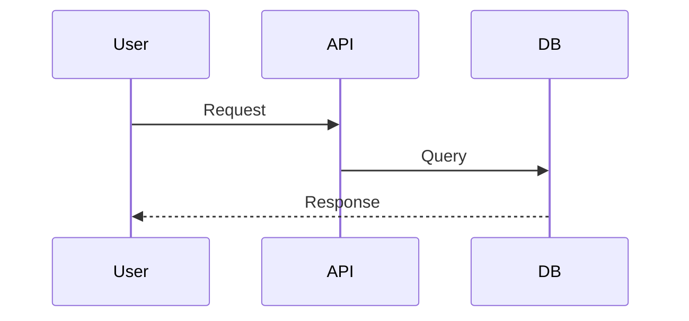

# Documentation Site Generator

PDF route: none

Generate complete documentation sites as a directory of Markdown files with navigation configuration and brand theming. Outputs are ready to build with MkDocs Material or Docusaurus.

## When to Use

- Customer-facing documentation portals
- Project documentation for delivered engagements
- Internal knowledge bases and runbooks
- API reference sites with guides
- Operations and troubleshooting documentation

Not this deliverable? See the Deliverable Routing table in the `doc-writer` skill: it covers long-form writeups, 1-2 page executive PDFs, and slide decks (PDF or Google Slides).

> **Publishing a prospect-facing POC guide site?** Use the `spectrocloud-poc-docs` skill for the full build→test→publish lifecycle (it composes this skill for theming) — including the Cloudflare Access gating step that must cover the `*.project.pages.dev` preview-URL wildcard, not just the apex hostname.

## Brand Integration

READ the `spectrocloud-brand` skill for colors, typography, and design principles before generating any themed site. Use the CSS custom properties from `spectrocloud-brand/references/colors.md` for all color values.

### CSS Custom Properties (from spectrocloud-brand)

```css
:root {
  --sc-teal: #1F7A78;        /* Primary brand */
  --sc-teal-dark: #005B5B;   /* Nav backgrounds, headers */
  --sc-teal-darkest: #043736;/* Deep contrast elements */
  --sc-green: #9EB277;       /* Secondary accent */
  --sc-gold: #F0BE65;        /* Highlights, callouts */
  --sc-orange: #B94B01;      /* Warnings, important */
  --sc-lilac: #7E5C8E;       /* Palette product accent */
  --sc-paper: #F7F1ED;       /* Background */
  --sc-ink: #012121;         /* Body text */
  --sc-neutral-2: #BEB9B6;   /* Borders, dividers */
}
```

## Output Structure

Every generated site follows this directory layout:

```
docs-site/
├── mkdocs.yml              # or docusaurus.config.js
├── docs/
│   ├── index.md            # Landing / overview (with co-branded logos)
│   ├── getting-started.md  # Quick start guide
│   ├── assets/
│   │   └── images/
│   │       ├── spectrocloud-logo.png        # SC logo for landing page
│   │       ├── spectrocloud-logo-white.svg  # SC logo for nav header
│   │       ├── favicon.png                  # SC favicon
│   │       └── customer-logo.svg            # Customer logo for landing page
│   ├── architecture/
│   │   ├── index.md        # Architecture overview
│   │   └── components.md   # Component deep-dives
│   ├── operations/
│   │   ├── index.md        # Ops overview
│   │   ├── deployment.md   # Deployment procedures
│   │   └── monitoring.md   # Monitoring and alerts
│   ├── troubleshooting/
│   │   ├── index.md        # Common issues
│   │   └── runbooks.md     # Step-by-step runbooks
│   ├── overrides/          # MkDocs theme overrides (inside docs/)
│   │   └── stylesheets/
│   │       └── brand.css   # Brand color overrides
│   └── reference/
│       ├── index.md        # Reference overview
│       ├── api.md          # API reference
│       └── configuration.md
└── static/                 # Docusaurus static assets
    └── css/
        └── brand.css
```

Adapt sections to the project. Not every site needs all sections. Omit what is irrelevant.

### Required Logo Assets

Always include these files in `docs/assets/images/`:

| File | Purpose |
|------|---------|
| `spectrocloud-logo-white.svg` | Header nav logo (set in `theme.logo`) |
| `spectrocloud-logo.png` | Landing page co-branding |
| `favicon.png` | Spectro Cloud favicon (set in `theme.favicon`) |
| `customer-logo.svg` (or `.png`) | Customer logo for landing page co-branding |

Source the Spectro Cloud logos from the `spectrocloud-brand` skill or existing project assets. Request or locate the customer logo as needed.

## File Naming Conventions

- **kebab-case** for all files and directories: `getting-started.md`, not `GettingStarted.md`
- **index.md** for section landing pages (not README.md)
- Group related pages in subdirectories when a section exceeds 3 pages
- Prefix numbered sequences only for ordered tutorials: `01-install.md`, `02-configure.md`

## MkDocs Material Configuration

Do not retype `mkdocs.yml` or the brand stylesheet by hand. Run `scripts/scaffold_docs_site.sh <dest> --site-name "<name>"` — it writes `assets/mkdocs.yml.tmpl` and `assets/brand.css` into `<dest>` as `mkdocs.yml` and `docs/overrides/stylesheets/brand.css`, with `__SITE_NAME__` already substituted. Adjust `nav` and `repo_url` in the scaffolded `mkdocs.yml` per project.

### MkDocs Brand CSS (`docs/overrides/stylesheets/brand.css`)

Shipped as `assets/brand.css` — the scaffolder copies it in as-is. Ink/neutral dark mode only (`#012121`, `#E0DCD7`, `#1E3332`); never the retired blue/purple dark mode.

## Docusaurus Configuration

Alternative config when Docusaurus is preferred.

```js
// docusaurus.config.js
const config = {
  title: 'Project Documentation',
  url: 'https://docs.example.com',
  baseUrl: '/',
  themeConfig: {
    navbar: {
      title: 'Project Docs',
      style: 'dark',
    },
    colorMode: {
      defaultMode: 'light',
      respectPrefersColorScheme: true,
    },
    footer: {
      style: 'dark',
      copyright: `Copyright ${new Date().getFullYear()} Spectro Cloud. All rights reserved.`,
    },
  },
  presets: [
    ['classic', {
      docs: { sidebarPath: './sidebars.js', routeBasePath: '/' },
      theme: { customCss: './src/css/brand.css' },
    }],
  ],
};
module.exports = config;
```

### Docusaurus Brand CSS (`src/css/brand.css`)

Map SC brand to Infima variables: `--ifm-color-primary: #1F7A78`, `--ifm-color-primary-dark: #005B5B`, `--ifm-color-primary-darkest: #043736`, `--ifm-background-color: #F7F1ED`, `--ifm-font-color-base: #012121`, `--ifm-font-family-base: 'Plus Jakarta Sans', 'Trebuchet MS', sans-serif`. Set `.navbar` and `.footer--dark` backgrounds to `#043736`.

## Markdown Conventions

### Page Frontmatter

Every page must include frontmatter:

```yaml
---
title: Page Title
description: One-line description for SEO and nav tooltips
sidebar_position: 1      # Docusaurus ordering
---
```

### Admonitions

Use admonitions for callouts. Supported types: `note`, `tip`, `warning`, `danger`, `info`.

```markdown
!!! note "Title Here"
    Content inside the admonition.

!!! warning "Breaking Change"
    This change requires migration steps.

!!! tip "Performance"
    Enable caching to reduce load times.
```

### Code Blocks

Always specify language. Use titles for clarity:

````markdown
```yaml title="mkdocs.yml"
site_name: My Docs
```

```bash title="Install dependencies"
pip install mkdocs-material
```
````

### Tabs

Group alternatives (OS, language, tool) in tabs:

```markdown
=== "Linux"

    ```bash
    sudo apt install mkdocs
    ```

=== "macOS"

    ```bash
    brew install mkdocs
    ```
```

### Diagrams

Use Mermaid for simple behavioural diagrams (sequence, state, flow). For structural/architecture diagrams (context, container, component), use the `architecture-diagrams` skill instead — it uses D2 and adds the `d2` plugin block to this skill's `mkdocs.yml` (keep the shared `pymdownx.superfences` mermaid fence from the config above; just merge in the d2 plugin).

````markdown

````

### Tables

Use Markdown tables for structured data. Align columns for readability in source:

```markdown
| Component   | Port | Protocol | Notes            |
|-------------|------|----------|------------------|
| API Gateway | 443  | HTTPS    | Public endpoint  |
| App Server  | 8080 | HTTP     | Internal only    |
```

## Section Templates

### index.md (Landing Page)

Shipped as `assets/index.md.tmpl` — the scaffolder writes it to `docs/index.md` with `__SITE_NAME__` substituted. It always co-brands the customer logo alongside the Spectro Cloud logo at the top of the page; fill in the project description and adjust Quick Links per project.

See `references/section-templates.md` for getting-started, troubleshooting, and runbook page templates.

## Navigation Organization

### Logical Grouping Rules

1. **Top-level tabs** map to audience intent: Learn, Build, Operate, Reference
2. **Sections** group by topic, not by document type
3. **Max depth**: 3 levels (tab > section > page). Flatten if deeper
4. **Order**: overview first, then by workflow sequence, reference last
5. **Naming**: use action verbs for tasks ("Deploy a Cluster"), nouns for concepts ("Architecture")

### Sidebar Best Practices

- Every directory has an `index.md` as its landing page
- Use `sidebar_position` in frontmatter for explicit ordering
- Keep sidebar items under 8 per section; split if larger

## Generation Checklist

- [ ] Config file (`mkdocs.yml` / `docusaurus.config.js`) is valid
- [ ] All nav entries point to existing files
- [ ] Every `.md` has frontmatter with `title` and `description`
- [ ] Brand CSS included with SC color overrides + Plus Jakarta Sans font
- [ ] Code blocks have language specified; kebab-case filenames throughout
